<!-- Removed static Global Header Component -->

<!-- RELOCATED DEBEZIUM IMAGE: Bottom right, small size -->

  <!-- Tasheer Logo -->
  
  
  <h1 class="text-6xl font-extrabold tracking-tight !leading-tight text-white mb-6">
  Modern Event-Driven Data Architecture
  </h1>
  
  

  Domain Events, CDC with Debezium for Scalable Microservices
  

<!--
Welcome everyone to this presentation on Modern Event-Driven Data Architecture. Today we'll explore how Domain Events, Change Data Capture (CDC), and Debezium enable scalable and maintainable microservices architectures. We'll dive into advanced patterns including CQRS, Outbox, Saga, and Event Sourcing.
-->

---
layout: two-cols
---

# Domain Events

### Definition
Events that represent significant business occurrences within a bounded context

### Key Benefits
<v-clicks>

- **Decoupling** - Services don't need direct dependencies
- **Scalability** - Independent service scaling
- **Real-time Reactions** - Immediate downstream processing
- **Audit Trail** - Complete history of business events

</v-clicks>

::right::

<v-click>

### Example: OrderPlaced Event

Single event triggers multiple independent reactions

</v-click>

<!--
Domain Events are business-significant occurrences that happen within your system. When an order is placed, that's not just a database update—it's a business event that triggers multiple reactions. The Inventory Service needs to reserve items, Payment Service processes payment, Notification Service sends confirmations, and Analytics tracks the sale. All these services react independently without tight coupling.
-->

---
layout: default
---

# Challenges of Implementing Domain Events

### Technical Challenges
<v-clicks>

- **Event Ordering** - Maintaining sequence across services
- **Reliable Delivery** - Guaranteeing at-least-once delivery
- **Data Consistency** - Keeping distributed state synchronized
- **Duplication** - Handling duplicate event delivery
- **Failure handling** - Failure handling & retries

</v-clicks>

<v-clicks>

</v-clicks>

<!--
While Domain Events provide many benefits, implementing them correctly is challenging. Events can arrive out of order, be duplicated, or lost entirely. Multiple services maintaining their own state can become inconsistent. When failures occur, we need strategies to compensate and recover. These challenges are exactly what CDC and Debezium help solve.
-->

---
layout: default
---

# CDC & Debezium Overview

### Change Data Capture (CDC)
Technique for tracking and capturing database changes in real-time

### Debezium Features
<v-clicks>

- **Database Support** - MySQL, PostgreSQL, MongoDB, etc.
- **Message Broker Support** - Kafka,Rabbitmq, Amazon Kinesis, etc.
- **Low Latency** - real-time capture
- **No Code Changes** - Non-intrusive

</v-clicks>

Debezium reads transaction logs and streams changes to Kafka

<!--
Change Data Capture is the foundation that solves many of our challenges. Instead of your application code publishing events, Debezium monitors the database transaction log—the same log used for replication and backups. This means every committed transaction is captured reliably and streamed to Kafka. It's non-intrusive: no changes to your application code, no performance impact, and guaranteed consistency.
-->

---
layout: default
---

# How Debezium Supports Domain Events

### The Power of CDC for Domain Events

- **Automatic Event Publishing** - Database changes become events automatically
- **Guaranteed Consistency** - Events only published on successful commit
- **Zero Code Changes** - Existing applications work unchanged
- **Support for Patterns** - Enables CQRS, Saga, Outbox natively

<!--
Here's where Debezium transforms our architecture. Database changes automatically become domain events. When an order is created, Debezium captures that insert and publishes it to Kafka as an OrderCreated event. Because it reads from the transaction log, events are only published after the transaction commits—giving us perfect consistency. This foundation enables all the advanced patterns we'll explore next.
-->

---
layout: default
---

# CQRS Pattern

**Command Query Responsibility Segregation**

### Key Concepts
- **Separate Write and Read Models** - Optimize independently
- **Denormalized Read Data** - Fast queries
- **Event-Driven Updates** - Write model changes propagate to read model
- **Scalability** - Scale reads and writes independently

### Benefits with Debezium
<v-clicks>

- Automatic synchronization
- No dual-write problem
- Eventual consistency guaranteed

</v-clicks>

Write model → Debezium → Optimized read models

<!--
CQRS separates write operations from read operations, allowing each to be optimized independently. Your write model can be highly normalized for data integrity, while your read model is denormalized for performance. Debezium bridges the gap: writes go to the normalized database, Debezium captures those changes, and a projection service updates the denormalized read database. This avoids the dual-write problem where you'd have to update both databases in your application code.
-->

---
layout: default
---

# Outbox Pattern

**Reliable Event Publishing with Transactional Consistency**

### The Problem
- Publishing events and saving data are separate operations
- Risk of data saved but event not published (or vice versa)

### The Solution
- Store events in an **Outbox Table** within same transaction
- Debezium captures outbox entries
- Events published reliably

### Guarantees
- **Atomicity** - Event and data saved together
- **At-least-once delivery**
- **No message loss**

Outbox table ensures event publishing is part of the transaction

<!--
The Outbox Pattern solves a critical problem: how do you reliably publish events when saving data? If you save to the database and then publish to Kafka, what happens if Kafka is down? You lose the event. If you publish first then save, what if the database save fails? With the Outbox Pattern, you write both your business data and an event record to an outbox table in the same transaction. Debezium monitors the outbox table and publishes events to Kafka. This guarantees that every committed transaction results in a published event.
-->

---
layout: default
---

# Saga Pattern

**Managing Distributed Transactions**

### Distributed Transaction Challenge
- No global ACID transactions across services
- Need coordinated multi-step workflows

### Saga Solution
- Break into local transactions
- Each step publishes events
- Compensating actions for rollback

### Debezium's Role
- Captures state changes reliably
- Triggers next saga steps
- Enables compensation events

```mermaid {scale: 0.6}
graph TD
    A[Order Created] -->|Success| B[Reserve Inventory]
    B -->|Success| C[Process Payment]
    C -->|Success| D[Ship Order]
    D --> E[Order Complete ✓]

    C -->|Failure| F[Release Inventory]
    F --> G[Cancel Order]
    B -->|Failure| H[Cancel Order]

    A -.->|via Debezium| B
    B -.->|via Debezium| C
    C -.->|via Debezium| D
    C -.->|via Debezium| F

    style A fill:#1A468B
    style B fill:#7ED321
    style C fill:#7ED321
    style D fill:#7ED321
    style E fill:#7ED321
    style F fill:#D0021B
    style G fill:#D0021B
    style H fill:#D0021B
```

Multi-step workflow with compensating actions

<!--
The Saga Pattern manages distributed transactions across multiple services. Instead of a single ACID transaction, a saga is a sequence of local transactions. When an order is created, we start a saga: reserve inventory, process payment, ship order. If payment fails, we need to compensate by releasing the inventory reservation and canceling the order. Debezium captures each state change and triggers the next step. This creates a reliable choreography where services react to events without tight coupling.
-->

---
layout: default
---

# Event Sourcing

**Storing State as a Sequence of Events**

### Core Concept
- Store **every state change** as an immutable event
- Current state = replay all events
- Events are the source of truth

### Benefits
- **Complete Audit Trail** - Every change recorded
- **Time Travel** - Rebuild state at any point
- **Debugging** - Replay events to reproduce issues
- **Analytics** - Rich historical data

### With Debezium
- Database becomes event store
- CDC provides event stream
- Services consume and rebuild state

Replay events to rebuild current state at any point in time

<!--
Event Sourcing takes event-driven architecture to its logical conclusion: instead of storing current state, store every event that led to that state. Your order isn't just a row with status "delivered"—it's a sequence of events: OrderCreated, PaymentProcessed, ItemShipped, OrderDelivered. This gives you a complete audit trail, the ability to time travel and see state at any point, and rich data for analytics. Debezium can treat your database as an event store, capturing every change as an immutable event.
-->

---
layout: center
class: text-center
---

# Questions?

### Contact & Resources

📧 presenter@company.com

🔗 github.com/debezium/debezium

📚 debezium.io/documentation

Thank you for attending!

<!--
I'd be happy to answer any questions about implementing these patterns, specific technical details about Debezium, or how to apply these concepts to your own architecture challenges.
-->
